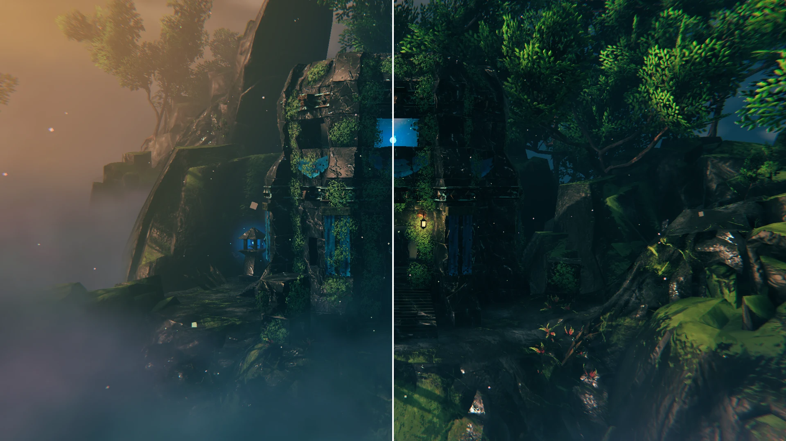
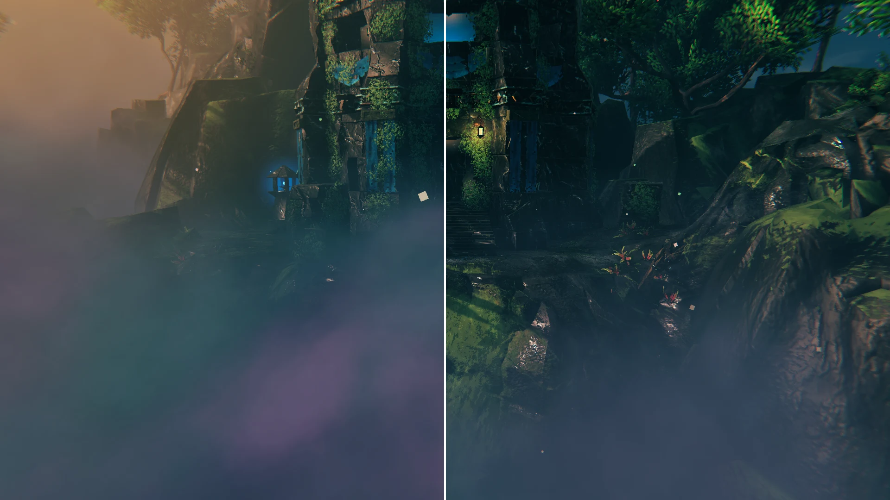
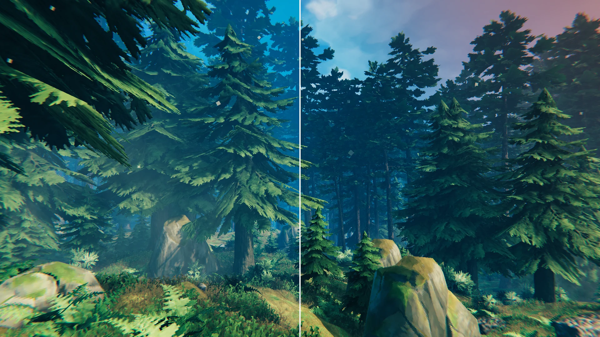
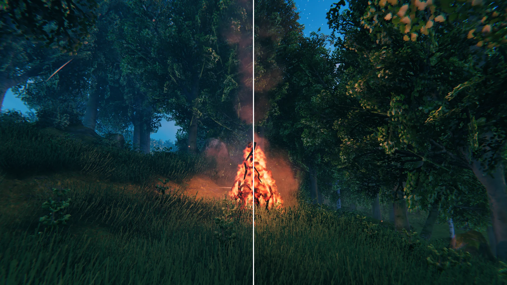
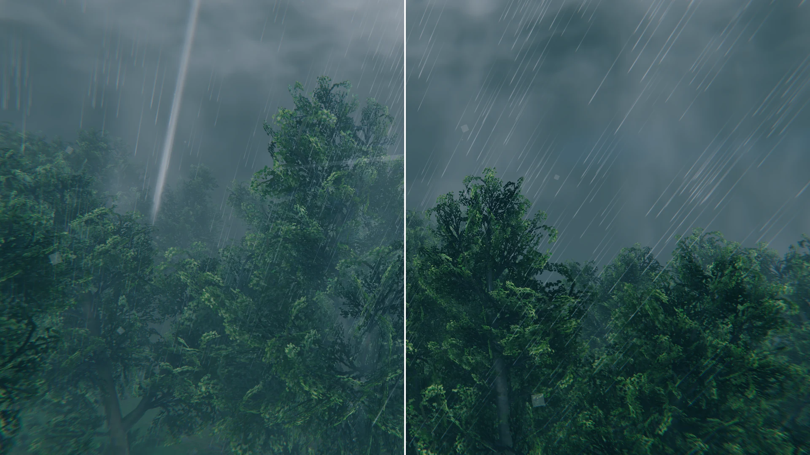

# Screenshots

Every picture is the same spot with the same camera and weather. The left half is vanilla, the right half has BetterFog with the default settings.

## Mistlands

A Dvergr tower:

Mist rolling over the ground:

## Black Forest

Misty weather between the pines:

## Fire smoke

A big campfire at dusk, the smoke column rises through the trees:

## Storm

Thunderstorm over the meadows:

